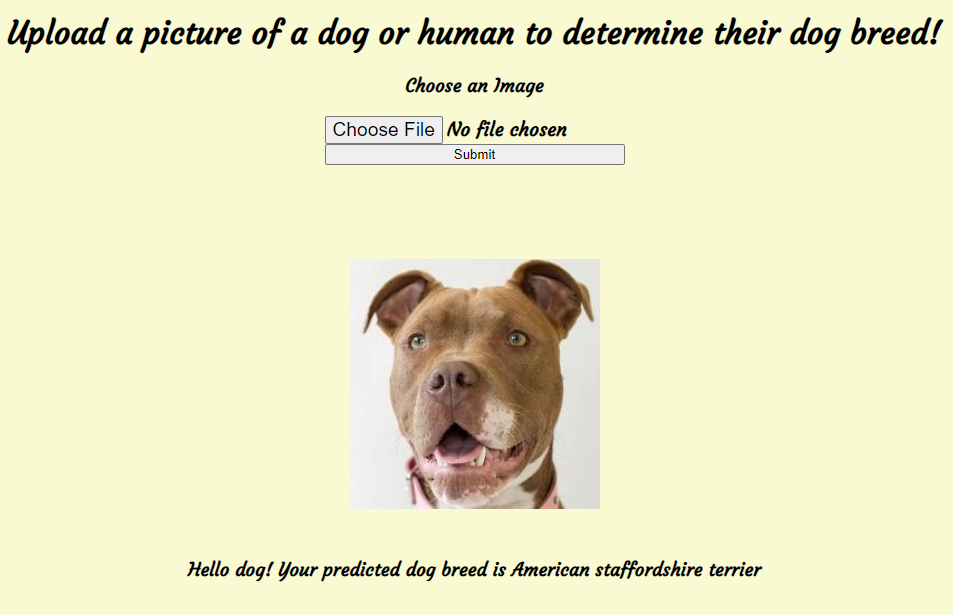
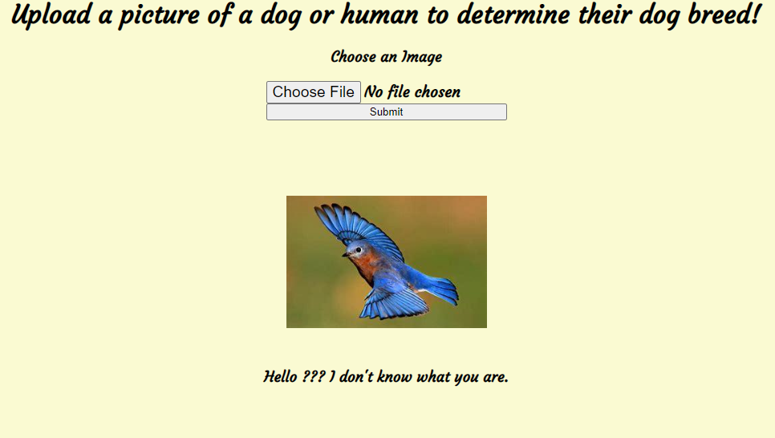
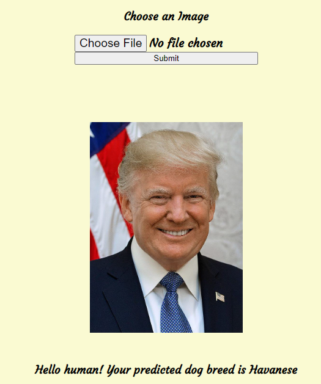

# Dog-Breed-Classifier-Project (Udacity DS Nanodegree Project Four)

## Table of Contents
1.  [Description](#description)
2.  [Getting Started](#getting-started)
3.  [Authors](#authors)
4.  [Licence](#license)
5.  [Acknowledgements](#acknowledgements)
6.  [Screenshots](#screenshots)

## Description
This Udacity project applies convolutional neural networks and transfer learning to an image classification problem. This guided project's goal is to classify the images of dogs based on their breed. A function is built that will accept any user-supplied image as input. If a dog is detected in the image, it will provide an estimate of the dog's breed. If a human is detected, it will provide an estimate of the dog breed that the human resembles.The dog breeds dataset comprises 8,351 dog images from 133 dog categories. The dataset is split into 6,680 training dog images, 835 validation dog images, and 836 test dog images. Networks pre-trained on the ImageNet datasets were used as a starting point. The last layers were removed and additional layers were added to tailor the network to dog breed classification problem. These pre-trained networks have already learned features that are useful for most computer vision problems and are much more accurate than building a model from scratch using only the examples provided. Metrics used to determine how well the model works are validation accuracy and training accuracy. Early stopping was used. The model with the lowest loss on the validation score was chosen. Because this is a proble

There are three major components to this project.
1. ETL Pipeline: This part of the project was provided by Udacity.
2. ML Pipeline: dog_recog.py, dog_app.ipynb, and ... maybe more???
    - Loads data from the SQLite database
    - Splits the det into training and test sets
    - Use ImageDataGenerator to augment images
    - Use transfer learning with VGG19 as base to build classifier.
    - Fine tune model by setting last block of VGG19 to trainable and slowly optimizing model weights with stochastic gradient descent.
    - Use transfer learning with ResNet as base to build classifier.
    - Fine tune model by setting last block of VGG19 to trainable and slowly optimizing model weights with stochastic gradient descent.  
    - Best model weights are saved for use in web app.
3. Flask Web App
    - Allow user to upload an image from local directory. Visualizes dataset 
    - Classify image using one of the classifiers mentioned.

## Getting Started
### Dependencies

- Python 3
- Sklearn
- Numpy
- Tensorlow,
- CV2
- Web App Library: Flask
- Data Visualization Library: Plotly

### Running the Code
- Using the Webapp
    1. Using your command prompt terminal, navigate to the project's directory. 
    2. In the terminal execute `python app.py`
    3. On the same machine, in your browser, navigate to [here](http://127.0.0.1:5000/home) to view the web app
            
## Authors
     -Charles Joseph
## License
[MIT OPENSOURCE LICENSE](LICENSE.TXT)
## Acknowledgements
- [Udacity](https://www.udacity.com/) for designing the project, providing images, and templates. 
- [The Keras Blog and Francois Chollet](https://blog.keras.io/building-powerful-image-classification-models-using-very-little-data.html) for providing a tutorial on image augmentation, transfer learning, and model fine-tuning.

## Screenshots

